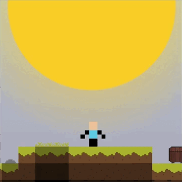

# -270 on Celsius



**-270 Celsius** is a 2D sandbox game with survival elements. The core concept revolves around surviving on a planet that is rapidly cooling down. You need to gather resources, build a base, and begin your descent closer to the planet's hot core to avoid freezing to death.

*   **Dynamic Temperature:** *in development
*   **Adapting Enemies:** *in development
*   **Biomes:** The world is generated based on various biomes: mountains, plains, forests, deserts, and snowy territories.
*   **Crafting System:** Features various tiers of workbenches, furnaces, crushers, and other structures to help you survive.

## Technical Stack

*   **Language:** Java 21+
*   **Build Tool:** Gradle 9.5.0
*   **Graphics:** LWJGL 3.4.1 (OpenGL 3.3 Core Profile)

## Project Structure

*   `src/main/core`: Core game logic
*   `src/assets`: Resources
*   `src/assets/content`: Content
*   `src/tools`: Development utilities

**Building the distribution:**

```bash
 ./gradlew jpackageImage
 ```

After building, the project structure must look like this:

* `src/`
* `celsius.exe`
* `config.properties`

### Join our Discord community: https://discord.gg/GBUP7QdA
